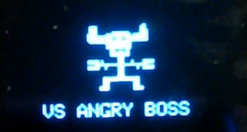
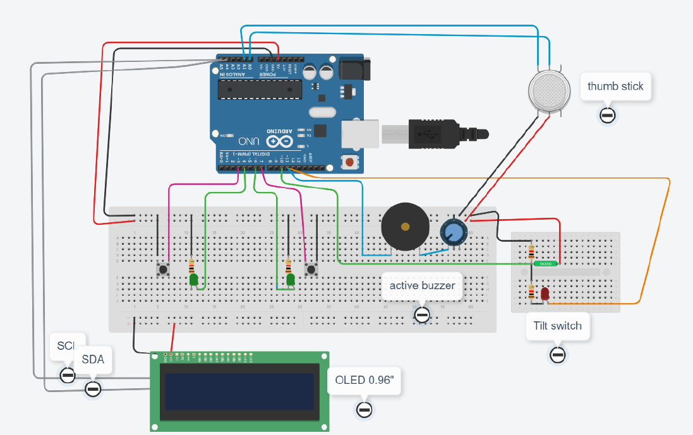
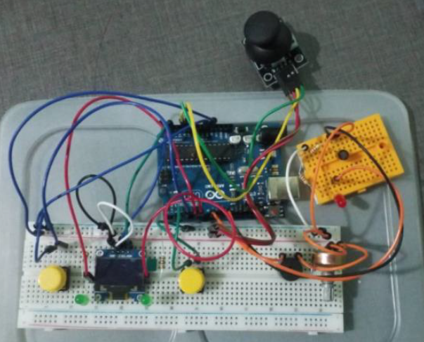

# ArduinoGameFromScratch

Create a game on arduino from scratch. 

Game screen are display on OLED. The player control the character with Thumb stick, 2 button, and by tilting the arduino board like a phone.

For more information and code, see [manual](document.pdf) (THAI)

## Usage
* Diagram

* Code is in [.cpp](code.cpp) file

## Game Play demo (Thai language)

Demo 1/2: https://www.youtube.com/watch?v=DuO7v2zZGrY

Demo 2/2: https://www.youtube.com/watch?v=qAGQX1hmQ1A